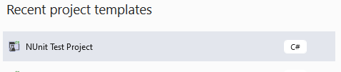
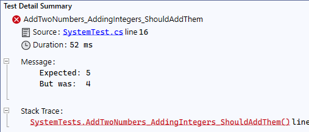

# Creating the First Test

## Setting Up the Project

There are two ways of organizing your code and your test cases. Either next to the file you are testing, or in a seperate project/folder.

Option 1 (The one I've seen most often):

- MainProject
  - Class1
  - Class2
  - ....
- MainProject.Test
  - Class1.Test
  - Class2.Test
  - ...

Option 2:

- MainProject
  - Class1
  - Class1.Test
  - Class2
  - Class2.Test

Putting them next to each other means it's easy to find the tests for a given class, but it also means that your folders are much larger, and you may need to do some setup to ensure they aren't included in production builds.

In C#/Visual Studio, adding a second project as a test is the simplest method as well. Right-click the solution, add a project and choose NUnit project (also avalable are xUnit and MSTest in the default project types).



Right click the test project and add a dependency to the main project you are testing. That will give you access to the public classes and methods of that project.


For a simple method to test, I added a single class, with a single method 'AddTwoNumbers'

```CSharp
public class System
{
    public int AddTwoNumbers(int num1, int num2)
    {
        return num1 + num2;
    }
}
```

In my test project, I'll add a matching class, with Tests or UnitTests at the end so the class names are different. The test project comes with a file already setup, so I just renamed it to our SystemTest class

```CSharp
public class SystemTests
{

    [Test]
    public void Test1()
    {
        Assert.Pass();
    }
}
```

## Creating the Test

The first thing to look at is the `[Test]` decorator. This lets Visual Studio know that this will be a test method, and it'll show up under VS's test explorer so we can easily run it whenever we want without having the file open.


### Naming the Tests

The recommended naming pattern is \<SystemUnderTest>\_\<TestCase>_\<ExpectedBehavior>. This seems pretty long at the beginning, but the point of this is to make it very clear what the test is supposed to accomplish. We won't be using these method name elsewhere in the code, you only need to type it out once.

So to create a test for our adding method, it would be something like `AddTwoNumbers_AddingIntegers_ShouldAddThem()`

### Arrange Act Assert

The three steps in a unit test are Arrange, Act, and Assert. Usually each step will be on it's own line, even if you could combine them. You may also want to put whitespace in between to further seperate them. Remember that we are trying to make tests as easy to read/write as possible, not as short as possible.

```CSharp
[Test]
public void AddTwoNumbers_AddingIntegers_ShouldAddThem()
{
    //Arrange
    var system = new System();

    //Act
    var actual = system.AddTwoNumbers(2, 2);

    //Assert
    Assert.AreEqual(4, actual, "Two plus two should equal four");
}
```

The last class used `Assert` is where the test framework we are using does the bulk of it's work. Most test frameworks will have some sort of assert or expect class that you use to run the final test to ensure you got the result you wanted. They will have a variety of methods to allow you to compare the results to an expected value, if something threw an error, or any number of other options.

In this case we are comparing our "expected" result, that 2 + 2 returns 4, to our actual result from the system under test. The third arugment in our test, the message, is optional, but is a good idea to include some info here in some frameworks. Your test framework will likely try to output a default message for a failed test, but it isn't always useful.

If I change the expected value to 5 and run the test with my test explorer, I'll get the expected and actual values, which in this simple case is fine.



### Adding Test Cases

Some frameworks, including NUnit, have the concept of test cases. This allows us to test multiple values using the same bit of code. To do this, we add a `[TestCase()]` decorator, and pass those values into our method as arguments.

```CSharp
[Test]
[TestCase(1, 3, 4)]
public void AddTwoNumbers_AddingIntegers_ShouldAddThem_WithCases(int num1, int num2, int expected)
{
    //Arrange
    var system = new System();

    //Act
    var actual = system.AddTwoNumbers(num1, num2);

    //Assert
    Assert.AreEqual(expected, actual);
}
```

### Setup and Teardown

Our current system is simple to setup, and we don't need to reset anything in order to run multiple tests that won't effect each other, but in a real program this is rarely the case. We'll start talking next time about situations where we need to remove dependencies to unit test our code, and things like that require significantly more setup.

There are also times where we need to undo the changes we've made after the test to ensure the next one isn't affected.

Rather than writting setup and teardown code each time, test frameworks will allow us to use special methods that will be run before and after each test in that class.

```CSharp
[Test]
public void AddTwoNumbers_AddingIntegers_ShouldAddThem_WithSetup()
{
    //Arrange
    //we don't have anything here because we are using the Setup method

    //Act
    var actual = _system.AddTwoNumbers(2, 2);

    //Assert
    Assert.AreEqual(4, actual);
}
```

### Testing Exceptions

The next thing to look at is what happens when we want an exception to happen for a given input. Some frameworks have you use some form of try/catch block yourself, but NUnit handles this for us as well.

I added a bit of code to our system to throw an exception if we send over any negative numbers then wrote the test to check it.

```CSharp
public int AddTwoNumbers(int num1, int num2)
{
    if(num1 < 0 || num2 < 0)
    {
        throw new ArgumentException("Numbers must be positive");
    }

    return num1 + num2;
}


[Test]
public void AddTwoNumbers_SendingNegativeNumbers_ThrowsException()
{

    //Assert
    Assert.Throws<Exception>(() => _system.AddTwoNumbers(-4, 0));
}
```

### Testing State Changes

The last thing to look at is when our method under test changes the state of a system instead of checking the return value. This often happens when a method is used to do something like set a public property.

I added a property to our system that holds the last value we added `public int LastResult { get; private set; }`. As you can imagine, this is still fairly straightforward. We run the function in the act step, but instead check the value of the property in the assert step.

```CSharp
[Test]
public void AddTwoNumbers_AddingIntegers_ShouldSetLastResultProperty()
{
    //Act
    _system.AddTwoNumbers(2, 2);

    //Assert
    Assert.AreEqual(4,_system.LastResult);
}
```
