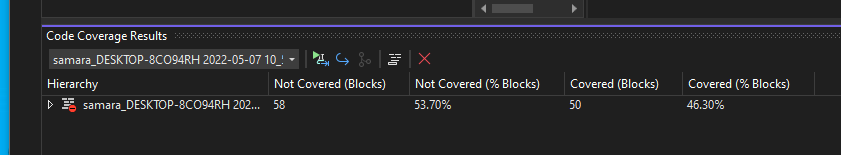

# Adding Unit Testing to Your Project

- Convincing Your Boss and Teammates
  - Take Responsibility
  - Have a Plan
  - Be Strategic
- Adding Tests to Legacy Code
  - Make Any New Code Testable
  - Divide and Conquer
  - Start With Integration and E2E Tests

## Convincing Your Boss and Teammates

### Take Responsibility

For testing to become part of an organization's strategy, there need to be people driving the idea forward. If you think testing is an essential aspect of software development and no one else is stepping up, you get to be the person pushing for the change.

The first thing to do when evaluating the situation is to figure out who is likely to be an ally and who will be against adding testing. If there is someone already pushing for this change, you can work with them as an ally yourself. This is not about creating factions. It is about the order in which you present your information. You want to start with the people likely to agree with you. They can then help you convince others who are opposed to the change.

### Have a Plan

When trying to convince people of something then, it helps to have reasons why they should make an effort. There are a couple of elements here. The first is to explain how you suggest how to make the changes. It doesn't have to be specific, but at least have a high-level plan of what this might look like. The second item is to have information on what value this change brings to the company. Adding tests to a project takes time and money that the company could spend on further development. It may also require devs to change their habits, incurring an additional cost in terms of time.

While many aspects of software dev best practices don't have data to back them up, testing has been studied over the years, so you can start with numbers to back up your claims. If you need a few to begin with, here are some I grabbed from Google. Once your organization implements testing, you can collect and use data about the process before and after to prove that your strategy is beneficial.

[On the Effectiveness of Unit Test Automation at Microsoft](https://collaboration.csc.ncsu.edu/laurie/Papers/Unit_testing_cameraReady.pdf)

[On the Relation Between Unit Testing and Code Quality](https://arxiv.org/pdf/1904.04748.pdf)

[On the Effectiveness of Unit Tests in Test-driven Development](https://bura.brunel.ac.uk/bitstream/2438/16116/1/FullText.pdf)

### Be Strategic

Looking for allies first has already been mentioned, but how to do the actual implementation may require a different strategy depending on the level of resistance on your team.

If the team is open to change, then you may be able to gather your resources and present a plan to adjust strategies fully from the beginning. In my experience, as a team member, this often won't go far without a monumental effort on your part. It's more likely to succeed when the recommendation comes from an outside source like a consultant.
Propose adding testing to a single section of the codebase as a pilot. If the team is embarking on a new project, this is a good target since building testable code from the beginning is more manageable than adding tests to existing code.
Add some tests first, then use that real-world result to help push your case. Going behind management's back is not an ideal solution. Still, in the real world, it's unfortunately common for devs to need to hide the time they spend on refactoring and maintenance since management doesn't see the immediate benefits.
In the worst case, the team will (hopefully) allow you to test your code but may be closed entirely to change. This doesn't necessarily mean that it's a bad job and you should leave, but it is often a symptom of a job that may not be "ideal."

## Adding Tests to Legacy Code

### Make Any New Code Testable

Legacy code that doesn't currently have tests is usually hard to test. The quickest way to start implementing a testing strategy is to start with new code. By setting the standard that any new code should be testable and come with tests, you can make forward progress with a minimal amount of dev time.

### Divide and Conquer

Some parts will be more testable than other parts when it comes to legacy code. Some code will also be more critical than others and could benefit more from testing. Unless you are in the unlikely scenario that you can halt development completely to refactor your existing codebase, you will likely need to add testing into your current timelines. To add it to your plans, breaking sections off into modules and tackling them allows the team to progress on testing while still producing new features.

### Start With Integration and E2E Tests

Unit testing legacy code is complicated, and refactoring it to make it testable is likely to break things. However, things like integration and end-to-end testing don't require the same seams that unit testing does. That makes starting with these sorts of tests a valuable tool when refactoring code. Depending on available resources, you might only write unit tests for new code while using integration and e2e testing to ensure you don't have regressions in legacy code.

### Collect Data Before and After

If your organization is new to testing, then you'll likely need to be able to prove that the extra work was worth it. The higher up the management chain you go the less terms like "best practices" will mean, and the more you need hard data to make your case. Collecting info on how long the dev process is and bugs found before and after are ideal metrics for showing the value of testing to the organization. For your fellow devs, you may also want to collect things like test coverage percentages (an optional report from many testing frameworks) to help ensure that goals are being met. 100% test coverage doesn't guarantee good tests any more than tests guarantee good code, but it does mean the devs have put at least some effort into things.

